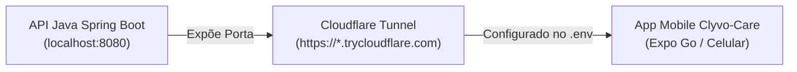

# Clyvo Care — Mobile Application

> **Challenge 2026 — Sprint 3 (Mobile Application)**  
> Aplicativo mobile desenvolvido em **React Native + Expo** integrado à API Spring Boot para o ecossistema **Clyvo Vet**, focado na gestão completa da saúde, planos e acompanhamento preventivo de pets.


## Sumário
- [Vídeo de Demonstração](#-vídeo-de-demonstração)
- [Repositório do Backend (API Java Spring Boot)](#-repositório-do-backend-api-java-spring-boot)
- [Inicialização Extrema (End-to-End: Java + Cloudflare Tunnel + Expo)](#-inicialização-extrema-end-to-end-java--cloudflare-tunnel--expo)
- [Inicialização Tradicional (Wi-Fi Local ou Emulador)](#-inicialização-tradicional-wi-fi-local-ou-emulador)
- [Solução do Projeto e Funcionalidades](#-solução-do-projeto-e-funcionalidades)
- [Rotas e Critérios Avaliativos da Sprint 3](#-rotas-e-critérios-avaliativos-da-sprint-3)
- [Tecnologias Utilizadas](#-tecnologias-utilizadas)
- [Arquitetura e Estrutura de Pastas](#-arquitetura-e-estrutura-de-pastas)
- [Diagnóstico e Comandos Úteis](#-diagnóstico-e-comandos-úteis)
- [Integrantes da Equipe](#-integrantes-da-equipe)


## Vídeo de Demonstração

> **Link do Vídeo no YouTube (máx. 5 minutos):** `[Link-do-video]`  
> *Demonstração completa da aplicação em execução contínua no celular físico, autenticação JWT, navegação protegida, operações de CRUD sincronizadas em tempo real com a API Java e tratamento de estados de carregamento.*


## Repositório do Backend (API Java Spring Boot)

O **Clyvo Care** consome a API RESTful desenvolvida no repositório parceiro do ecossistema Clyvo Pet:

**Repositório da API:** [ClyvoPet-Challenge-2026/Java-Sprint-1](https://github.com/ClyvoPet-Challenge-2026/Java-Sprint-1)

### Sobre a API Java:
- **Tecnologias:** Java 23, Spring Boot 4.0.6, Spring Data JPA / Hibernate, Spring Security, Flyway e Banco Oracle.
- **Domínio Administrativo & Contratação:** Responsável pelo gerenciamento de tutores (`TB_CAD_OWNER`), pets (`TB_CAD_PET`), planos (`TB_CAD_PLAN`), contratações/assinaturas (`TB_CAD_SUBSCRIPTION`), taxonomia de espécies e raças (`TB_CAD_SPECIES`, `TB_CAD_BREED`).
- **Segurança:** Autenticação stateless via tokens JWT assinados com par de chaves RSA (RS256) e criptografia de senhas com `BCryptPasswordEncoder`.
- **Porta Padrão:** Executada localmente na porta `8080` (`http://localhost:8080`).


## Inicialização Extrema (End-to-End: Java + Cloudflare Tunnel + Expo)

> [!TIP]
> **Por que usar a Inicialização Extrema?**  
> Ao rodar o app no celular físico (via Expo Go), o uso de redes móveis (Hotspot 4G/5G) ou roteadores com **isolamento de cliente (Client Isolation)** bloqueia requisições enviadas ao IP local da sua máquina (`192.168.x.x` ou `172.20.x.x`), causando *Network Timeout*.  
> O **Cloudflare Tunnel (`cloudflared`)** cria uma ponte segura HTTPS direta da internet para a porta `8080` do seu computador, garantindo que o aplicativo funcione de ponta a ponta em qualquer celular, sem configurações complexas de rede.

Siga os 4 passos abaixo para subir todo o ecossistema em um único fluxo:



### Passo 1: Iniciar a API Java
No diretório do projeto backend (`Java-Sprint-1`):
```bash
cd ../Java-Sprint-1
./mvnw spring-boot:run
```
*(Aguarde até a mensagem indicando que o Spring Boot iniciou na porta 8080)*.

---

### Passo 2: Iniciar o Túnel Cloudflare
Em uma nova janela de terminal, inicie o túnel temporário:
```bash
# Caso o executável esteja no seu diretório de usuário:
~/cloudflared tunnel --url http://localhost:8080

# Ou caso instalado globalmente no sistema:
cloudflared tunnel --url http://localhost:8080
```
O Cloudflare exibirá no terminal a URL pública gerada:
```text
+--------------------------------------------------------------------------------------------+
|  Your quick Tunnel has been created! Visit it at:                                          |
|  https://exemplo-aleatorio-gerado.trycloudflare.com                                       |
+--------------------------------------------------------------------------------------------+
```
*(Copie essa URL HTTPS gerada)*.

---

### Passo 3: Configurar o `.env` do Clyvo-Care
No diretório deste projeto (`Clyvo-Care`), crie o arquivo `.env` (se ainda não o tiver) e cole a URL:
```bash
cp .env.example .env
```
Edite o arquivo `.env`:
```env
EXPO_PUBLIC_API_URL=https://exemplo-aleatorio-gerado.trycloudflare.com
```


### Passo 4: Iniciar o Aplicativo Expo
No diretório do `Clyvo-Care`, instale as dependências e inicie o Expo com cache limpo:
```bash
# Instalar dependências (caso seja a primeira execução)
npm install

# Iniciar o Expo no modo túnel com cache limpo
npx expo start

ou

npx expo start --tunnel
```
Abra o app **Expo Go** no seu smartphone (Android ou iOS) e escaneie o QR Code exibido no terminal.

---

### Credenciais de Acesso (Login & Demonstração)

> [!IMPORTANT]
> **Usuário e Senha de Teste:**  
> As credenciais de acesso oficiais utilizadas para homologação e avaliação **estão demonstradas detalhadamente no vídeo de apresentação da Sprint**.  
>  
> Caso deseje criar um novo usuário na hora, utilize o fluxo nativo de **"Cadastre-se"** diretamente no aplicativo:
> - O backend valida regras estritas de formato e dígitos verificadores de CPF (`@CPF`).
> - A senha é automaticamente persistida com hash seguro BCrypt no banco Oracle.


## Inicialização Tradicional (Wi-Fi Local ou Emulador)

Caso prefira conectar diretamente sem utilizar o Cloudflare Tunnel:

### 1. Via Emulador Android Studio (mesma máquina)
Configure no `.env`:
```env
EXPO_PUBLIC_API_URL=http://10.0.2.2:8080
```

### 2. Via Dispositivo Físico na Mesma Rede Wi-Fi Convencional
1. Certifique-se de que computador e smartphone estão no mesmo roteador Wi-Fi residencial (sem isolamento).
2. Descubra o IP local do computador:
   ```bash
   # Linux / macOS:
   ip route get 1.1.1.1 | awk '{print $7}'
   # Windows:
   ipconfig
   ```
3. Configure no `.env`:
   ```env
   EXPO_PUBLIC_API_URL=http://<SEU_IP_LOCAL>:8080
   ```
4. Inicie o Expo:
   ```bash
   npx expo start -c
   ```


## Solução do Projeto e Funcionalidades

O **Clyvo Care** é o portal do tutor dentro da plataforma Clyvo Vet. Suas principais atribuições são:
1. **Autenticação Segura:** Login stateless com token JWT, persistência com `AsyncStorage` e interceptor de requisições.
2. **CRUD Completo de Pets:** Cadastro de pets com seleção de espécies e raças vindas da API, listagem dinâmica filtrada por tutor, edição de dados e remoção com invalidação automática de cache.
3. **CRUD Completo de Tutor (Perfil):** Visualização dos dados do responsável, edição de contato/endereço e exclusão definitiva de conta (`DELETE /responsaveis/{id}`).
4. **Contratação de Planos de Saúde Pet:** Visualização e contratação de planos veterinários categorizados por cobertura.
5. **Agendamento de Consultas:** Agendamento veterinário associando o pet cadastrado às clínicas disponíveis.
6. **Preferências e Temas:** Alternância dinâmica entre modo Claro (*Light*) e Escuro (*Dark*).


### Detalhamento das Telas e Endpoints

```text
Fluxo Não Autenticado:
├── LoginScreen       -> POST /auth/login (Autenticação com JWT)
└── RegisterScreen    -> POST /responsaveis (Cadastro de novo tutor com validação de CPF)

Fluxo Autenticado (Protegido por AuthGuard):
├── MainScreen        -> GET /planos | GET /pets (Dashboard com carrossel de planos e pets ativos)
├── RegisterPet       -> GET /especies | GET /especies/{id}/racas | POST /pets | PUT /pets/{id}
├── MyPet             -> GET /pets (por tutor) | DELETE /pets/{id} (CRUD Completo de Pets)
├── MakeAppointment   -> Integração com dados do tutor e pet para agendamento clínico
└── MyInformations    -> GET /responsaveis/{id} | PUT /responsaveis/{id} | DELETE /responsaveis/{id} (CRUD Completo de Tutor)
```

## Tecnologias Utilizadas

- **Framework Core:** [React Native](https://reactnative.dev/) & [Expo SDK 57](https://expo.dev/)
- **Linguagem:** [TypeScript](https://www.typescriptlang.org/)
- **Gerenciamento de Estado & Cache:** [TanStack Query v5 (`@tanstack/react-query`)](https://tanstack.com/query)
- **Cliente HTTP:** [Axios](https://axios-http.com/)
- **Navegação:** [React Navigation v7](https://reactnavigation.org/) (`@react-navigation/native-stack`)
- **Persistência Local:** [AsyncStorage](https://react-native-async-storage.github.io/async-storage/)
- **Estilização:** [NativeWind v4](https://www.nativewind.dev/) (Tailwind CSS para React Native)
- **Ícones:** [Lucide React Native](https://lucide.dev/)
- **Túnel de Conexão:** [Cloudflare Tunnel (`cloudflared`)](https://developers.cloudflare.com/cloudflare-one/connections/connect-networks/)


## Arquitetura e Estrutura de Pastas

O código segue padrões limpos de arquitetura em camadas para React Native:

```text
Clyvo-Care/
├── App.tsx                     # Ponto de entrada com Providers (QueryClient, Auth, Theme, Navigation)
├── src/
│   ├── Components/             # Componentes visuais reutilizáveis (Header, Modais, Cards)
│   ├── Context/                # Contextos globais (AuthContext para sessão JWT, ThemeContext)
│   ├── Data/                   # Dados auxiliares (estados, cidades, mocks estruturais)
│   ├── Hooks/                  # Custom Hooks desacoplando TanStack Query da UI (usePets, usePlans)
│   ├── Lib/                    # Instância do QueryClient e definições de QueryKeys
│   ├── Navigation/             # Definição e proteção das rotas (RootNavigator, AuthStack, RootStack)
│   ├── Screens/                # Telas funcionais do aplicativo
│   ├── Services/               # Camada de comunicação com a API RESTful (Axios)
│   └── Types/                  # Interfaces e tipagens TypeScript compartilhadas
├── .env.example                # Template das variáveis de ambiente
└── package.json                # Dependências e scripts de execução
```


## Diagnóstico e Comandos Úteis

| Ação | Comando |
| :--- | :--- |
| **Iniciar Túnel Cloudflare (porta 8080)** | `cloudflared tunnel --url http://localhost:8080` |
| **Testar se o Java está respondendo** | `curl -i http://localhost:8080/especies` |
| **Testar login via terminal** | `curl -i -X POST http://localhost:8080/auth/login -H "Content-Type: application/json" -d '{"email":"seu_email","password":"sua_senha"}'` |
| **Iniciar Expo com cache limpo** | `npx expo start -c --tunnel` |
| **Verificar processos ativos** | `ps aux \| grep -E "cloudflared\|expo\|java"` |


## Integrantes da Equipe

| Nome do Aluno | RM | |
| :--- | :---: | :--- |
| *André Emygdio Ferreira*      | *RM565592* |
| *Gabriel Lourenço Martins*    | *RM562194* |
| *Giovane Amato dos Santos*    | *RM561336* |
| *Matheus Roque Arantes*       | *RM561959* |
| *Orlando Gonçalves de Arruda* | *RM561584* |